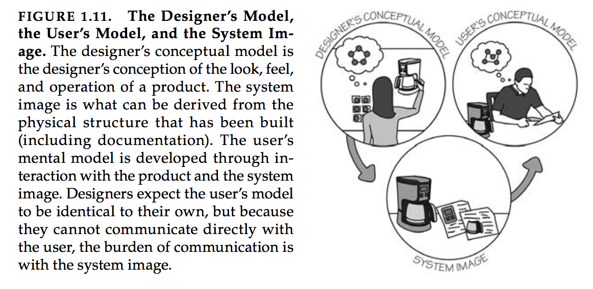

# Design of Everyday Things

Book by Dan Norman.

# Characteristics of Design

1. Discoverability

Whether the user is able to figure out what actions are possible.

2. Understanding

What does this all mean and what is the product supposed to do. I believe it to be a form of mental model about the user and the machine.

# Human Centered Design (HCD)

HCD means to start with a good understanding of people and the needs that the design is intended to meet. The understanding comes primarily through observation, for people themselves are unaware of their true needs.

Focus on *not just when the cases go right* but also when the *cases go wrong*.

# Fundamental Principles of Interaction

Experience is strongly determined by the quality of interaction. It is critical for it affects the how the product is perceived.

## Affordances

An affordance is a *relationship between a physical object and its product*: the abilities of the user and the properties of an object allows for a use case.

There are perceivable and unperceivable affordances.

Example: the structure of a chair and the shape of a person allows for sitting.

## Signifier
Signifiers *communicate what action should take place*.

Difference from affordance is that signifiers indicate where the actions are possible, but affordance is about what actions are possible.

Example: Bookmark indicates page in book

## Mapping

Relationship between two sets of things.

Natural mapping leads to immediate understanding. An example of natural mapping is spacial configuration.

## Feedback

Feedback must be immediate and descriptive. There should also be a limited amount of feedback.

Feedback has to be planned. *All actions need to be confirmed, ideally in an unobtrusive manner if its not important*.

## Conceptual Models

A conceptual model is an explanation, usually highly simplified, about how something works. It doesn't have to be complete or accurate, it just has to be useful.
*Simplified models are valuable only as long as the assumptions that support them hold true.*

These models should match.

# Psychology of everyday actions

All three levels of processing work together. All play essential roles in determining a person’s like or dislike of a product or service.

## Cognition vs emotion

Dan Norman raises a question about whether cognition happens first or whether emotion happens first.

He believes that they are intertwined. Emotion affects how we retrospectively think about things. Cognition affects our feelings about a product.

## Design questions that users should answer

