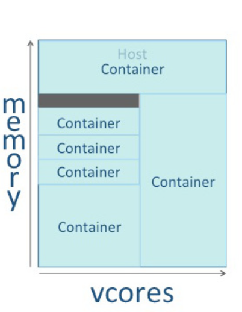

# Hadoop

Hadoop streaming allows one to create and run Map/Reduce jobs with any executable or script as the mapper/reducer

## How does streaming work
Mapper and reducer are executables that read the input from stdin, and emit output to std out. 
**Utility will create a Map/Reduce job, submit job to appropriate cluster, monitor the progress of the job until it completes**


Specify executable for mappers, each mapper launches *executable as a seperate process* when the mapper is initialized. Mapper task runs, converts inputs into lines and feeds lines to stdin of process. 

Prefix of line up to first tab character is the key and the rest of the line will be the value. 

Each executable is a seperate process, converts key value pairs into lines and feeds the line oriented outputs from the stdout of the process. 

## Hadoop Distributed File System (HDFS)
Distributed file system desgined to run on commodity hardware. Provides high throughput access, POSIX requirements for streaming. 


Consists of NameNode that manages the file system Metadata and Datanode that store actual data

NameNode: maintains file system tree and the meta data for all the files and directories present in the system. Two files "Namespace image" and the "Edit Log" are used to store metadata information. 

DataNode: slaves which reside on each machine in a cluster and provide the actual storage. 

## Map Reduce

Mapper maps input key/value pairs to a set of intermediate key/value pairs. 

Transform input records into intermediate records, a given input pair may map to zero or many output pairs. Map reduce spawns zero or many output pairs. 


Output pairs do. 


## Data Format
Hadoop uses google protobuff to specify data format


## Formula for calculating number of mappers
```
goal_num = mapred.map.tasks
split_size = max(mapred.min.split.size, block_size)
split_num = total_size / split_size
compute_map_num = min(split_num, max(default_num, goal_num))
```

## Overview of Yarn cluster

YARN cluster is composed of host machines. Tuning consists primarily pof defining containers on your worker hosts: container is a rectangular graph consisting of memory and vcores. 




Hosts: provide memory and CPU resources
Virtual Core (vcore): Usage share of a host CPU
Application: yarn client that is made up of one or more tasks. A task uses all of the available resources in the container. A task is unable to consume more that its designated allocation. In other terms, I think an application consumes within the confines of the container. 

## Phases in YARN tuning

1. Cluster configuration: configure hosts
2. YARN configuration: quantify memory and vcores (defining containers)
3. MapReduce configuration: allocate minimum and maximum resources for specific map and reduce tasks. 


https://www.cloudera.com/documentation/enterprise/5-4-x/topics/cdh_ig_yarn_tuning.html
