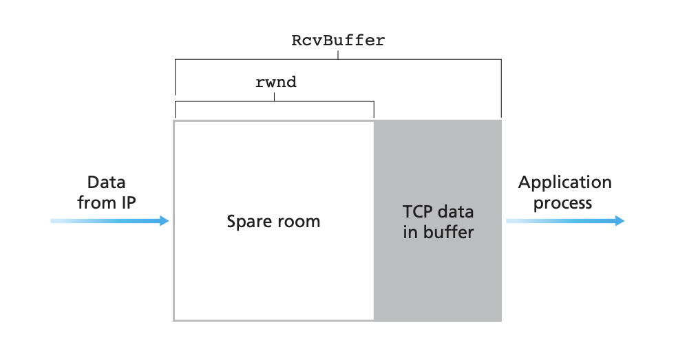
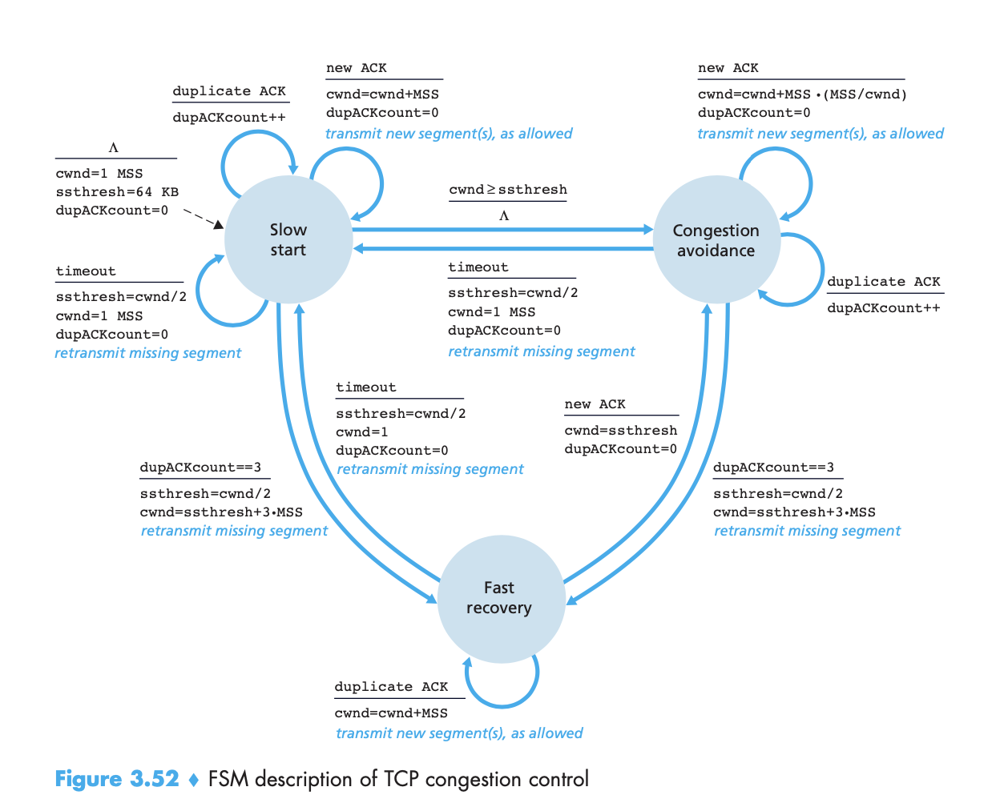

# Networks

## Overview

Internet: A system that connects end systems.

- The system consists of *communication links* and *packet switches*. There are many types of communication links which are made up of *physical media, copper wire, optical fibre*, in *switches* and *links.*

## Network Core

Messages may perform a control functions. There are two predominant types: *routers* and *link-layer switches*.

Store and forward mechanism: packet must first receive the entire packet before it can begin to transmit the first bit of the packet onto the outbound link.

*Output buffer*: plays a key role in packet switching.

### Types of delay

    1. Nodal processing delay

Delay in examining the packet header and determining where to direct the packet. Time needed to check for bit-level errors in the packet.

    2. Queueing delay

Delay in queue on outgoing link.Depends on the intensity and nature of traffic at the queue.

    3. Transmission delay

Length of packet: L bits, transmission rate is R bits/sec. Amount of time needed to push all of the packet's bits into the link.

    4. Propagation delay

 Bit propagates at the propagation delay of the link. Propagation speed depends on the speed of the link.

In total, these give a *total nodal delay*.

### Packet loss

Queue capacity is finite, packet can arrive at the router and find a full queue. With no place to store such a packet, the router will drop the packet and lose it.

### Throughput

bits per second. The transmission rate is determined by the bottleneck link.

### Protocol Layers

- Layered architecture

- Network designers organise protocols in layers.

Application - message
Transport - segment
Network - datagram
Link - frame

## Transport layer services

- logical communication between *application processes* running on different hosts

- transport layer segments: break application messages into smaller chunks and adding a transport layer header before each chunk

### Key ideas in TCP

#### Go-Back-N

Problem: under utilization of link, hence we need to batch send

Sender is allowed to transmit multiple packets without waiting for an acknowledgement, but is constrained to have no more than `N` unacknowledged packets.

Timer - oldest transmitted but not acknowledged packet.

Out-of-order packets are discarded in TCP messages.

ACK: Cumulative

#### Selective Repeat

Problem: with go-back-N, the messages are all pipelined and there is a risk of too much retransmission.

ACK individual packets, and only retransmit those.

#### Summary

https://networkengineering.stackexchange.com/questions/29417/tcp-and-go-back-n

TCP is similar to GBN because both protocols have a limit on the number of unACK'd packets that the sender can send into the network. However, TCP is different from GBN because GBN requires the re-transmission of every unACK'd packet when packets are lost, but TCP only retransmits the oldest unACK'd one.

TCP is similar to selective repeat because, when packets are lost due to congestion, the protocols do not require the sender to retransmit EVERY unACK'd packet sent by the sender. The sender just retransmits the oldest unACK'd packet. TCP is different from selective repeat because SR requires individual acknowledgement of each packet that was sent by the receiver; but rather than selectively ACKing every packet, TCP sends an ACK for the next packet that it is expecting (like GBN) and buffers the ones that it has received so far, even if they're out of order (like SR). That's why it can be considered a hybrid.

### Flow Control

Sender control: TCP provides the service to eliminate the possibility of *sender overflowing receivers buffer*.

Hosts on each side of a TCP connection sets aside a receive buffer for the connection. *Sender* maintains a variable called the *receive window*: give an idea of free buffer space in the receiver.

*LastByteRcvd – LastByteRead <= RcvBuffer*

*rwnd = RcvBuffer – [LastByteRcvd – LastByteRead]*

*LastByteSent – LastByteAcked <= rwnd*

### Congestion control

Sender control: TCP sender can be throttled due to *congestion within the IP network.*

#### End-to-end congestion control

Network layer provides no explicit report to the transport layer for congestion control purposes.

#### Network-assisted congestion control

Network components provide explicit feedback to the sender regarding the congestion state in the network.

1. Choke packet

2. Router marks/updates a field indicating congestion control

### TCP Congestion Control
`LastByteSent – LastByteAcked <= min{cwnd, rwnd}`

#### Slow Start
- Initialized with small value

- Exponential growth because rate doubles every RTT.

- On first loss, sets a slow start threshold, and TCP transitions into congestion avoidance mode.

#### Congestion Avoidance
- cwnd is approximately half its value when congestion was last encountered.

- Increases cwnd single MSS every RTT. TCP increases cwnd by MSS bytes when a new acknowledgement arrives.

#### Fast Recovery

- On packet loss, transition to this state. (duplicate ACK)

- Set *ssthresh = cwnd/2* and *cwnd = ssthresh + 3 * MSS* and *retransmit missing segment*()

- Different ways that fast recovery is done, but main goal is to enter some kind of `recovery` state.

#### Summary

Congestion control: AIMD (Additive increase, multiplicative decrease).

This gives rise to a "saw tooth" like behaviour.

### 

## URIs vs URLs

URI: Uniform resource indicator

URL: Uniform resource locator

URL is a subset of URI. URI is the identifier of a resource and it can be a locator.
