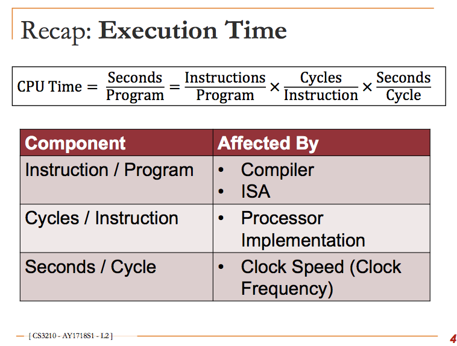
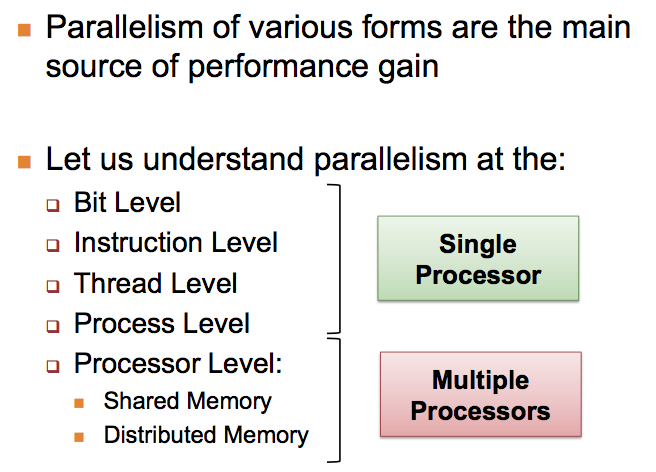

# Parallel Computing
## Background

## Parallel Computer Memory Organisation

1. Distributed-Memory

2. Shared-Memory

    - Uniform Memory Access

    - Non-Uniform Memory Access

    - Cache-only Memory Access

3. Hybrid (Distributed-Shared Memory)

## Processor Performance Gain

Levels of parallelisation:

- Bit level

- Instruction level

- Thread level

- Process level

- Processor level

### Instruction Level Execution
Pipelining:

Splitting the instruction into multiple stages. allowing multiple instructions to occupy different stages in the same clock cycle.

Superscalar:

Allowing multiple instruction to pass through the same stage. Scheduling how instructions are executed together.

## Steps

1. Decomposition

breaking a task into sub components

2. Scheduling

of tasks to processes/threads.
3. Mapping

of processes to cores

## Process

A process is a program in execution.

A *process* is broken into several components.

1. Executable program

2. Global data

Process are abstraction that let you exploit multiple cores/parallel processes.

Processes were initially created to allow for multitasking.

There are two types of multitasking.

1. Time slicing of execution
2. Parallel execution on multiple resources.

## Parallel Architecture Taxonomy

1. Single Instruction Single Data (SISD)

- A single instruction stream is executed.
- Each instruction work on single data
- Most uniprocessors fall into this category.

2. Single Instruction Multiple Data (SIMD)

- Single stream of instructions
- Each instruction works on multiple data
- Exploits data parallelism

3. Multiple Instruction Single Data
